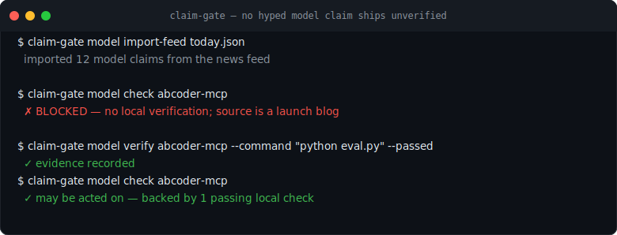

# claim-gate

[](https://github.com/yingchen-coding/claim-gate/actions/workflows/ci.yml)
[](pyproject.toml)
[](LICENSE)



**One evidence-gated ledger for public AI claims and signals — many domains, one CLI.**

Public AI claims arrive faster than they can be verified: a model is "cheaper", an infra trend is
"the next bottleneck", a bio result is "deployable". claim-gate keeps each claim in a **local
evidence ledger**, checks it against **domain-specific evidence rules**, and emits a blunt
recommendation — `act` / `track` / `verify-first` / `reject` — so hype never silently becomes a
decision.

It is local-first and zero-dependency. Nothing leaves your machine.

## Star This If

- You track AI/model claims and want them backed by local evidence, not hype.
- You want one CLI that gates each claim as `act` / `track` / `verify-first` / `reject`.
- You need an auditable, local-first ledger of what's verified, unproven, or rejected.

## Why It Matters

AI teams lose time when hype turns directly into roadmap, dependency, or investment decisions.
claim-gate inserts a small but strict step between "interesting claim" and "act on it":

1. record the claim with a source
2. classify the domain and risk
3. attach evidence or leave it blocked
4. export a decision-ready ledger

The default posture is conservative. A claim can be useful and still remain `verify-first` until
independent evidence exists.

## Quick Start

```bash
python -m pip install -e .
claim-gate --list-domains
claim-gate model add \
  --subject "ExampleModel" \
  --claim-type benchmark \
  --claim "Claims a new coding benchmark result." \
  --source-url "https://example.com/model-card"
claim-gate model validate
```

Expected behavior: the claim is tracked, but it does not become actionable unless the domain rules
say the evidence is strong enough.

## Domains

Each domain is a self-contained ledger with its own schema, vocabulary, validation rules, and
scoring. They share one CLI, one package, and one shared engine.

| Domain | `claim-gate <domain>` | What it gates |
|---|---|---|
| **infra-cost** | `claim-gate infra-cost` | Public AI infrastructure cost signals (GPU waste, cooling, energy, supply, cloud-margin) — scored by decision impact. |
| **bio** | `claim-gate bio` | Bio-AI claims behind an evidence **and safety** gate; refuses construction/wet-lab framing, requires public sources and reproduction. |
| **model** | `claim-gate model` | Model benchmark / cost / safety / adoption / medical claims, including physical-AI deployment gates and an event-graph export. |

## Install

```bash
pip install -e .
```

## Use

```bash
# list domains
claim-gate --list-domains

# record an infra-cost signal, then validate and export the ledger
claim-gate infra-cost add \
  --title "GPU utilization waste becomes a major AI cost driver" \
  --source-type public_news \
  --source-url https://example.com/gpu-waste \
  --signal-type utilization-waste --cost-driver gpu \
  --summary "Public article reports deployed accelerators sit underutilized." \
  --impact high --status actionable
claim-gate infra-cost validate
claim-gate infra-cost export --output signals.md

# audit a model claim — verify-first until evidence is attached
claim-gate model add \
  --subject ExampleModel --claim-type benchmark \
  --claim "Independent benchmark result." \
  --source-url https://example.com/benchmark
claim-gate model validate
```

Each domain exposes `add`, `list`, `validate`, and `export` (model also has `import-feed` and an
`event-graph-csv` export). Run `claim-gate <domain> --help` for the full command set.

## Architecture

```
claim_gate/
├── engine.py          # shared primitives every domain sits on (timestamps, JSON ledger I/O)
├── cli.py             # `claim-gate <domain> ...` dispatcher
└── domains/
    ├── infra_cost/    # signal schema + cost vocabulary + impact scoring
    ├── bio/           # claim schema + hazard classes + safety refusal rules
    └── model/         # claim schema + physical-AI gates + feed import + event-graph export
```

Adding a domain means dropping a module under `domains/` and registering its `main(argv)` entry —
the CLI, packaging, and CI come for free.

## License

MIT — see [LICENSE](LICENSE).
